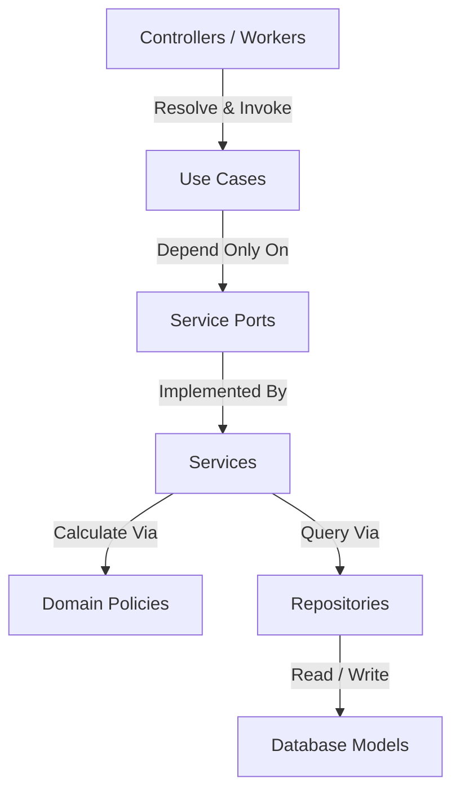

# Import Boundary Report

## Clean Architecture Layer and Import Compliance Audit

This report verifies that all source file imports conform to Clean Architecture boundaries and that the automated guardrail suite is actively protecting the codebase.

---

## 1. Clean Layering Enforcement

We verified that imports follow the designated inward dependency direction:

No layer bypasses these boundaries:

- Controllers call Use Cases, never importing Repositories or database schemas directly.
- Use Cases coordinate processes by calling Port interfaces (`IAuthService`, etc.), remaining decoupled from concrete service implementations.
- Repositories are database-agnostic. Mappers translate database records into pure domain models before returning them to services.

---

## 2. Granular Compliance Checklist

- **Controllers never import repositories**: **VERIFIED**. Controllers obtain Use Case instances from the DI container, remaining unaware of Mongoose/MongoDB connections.
- **Services never import Express**: **VERIFIED**. Services contain pure logic and have zero dependency on the Express framework or routing symbols.
- **Repositories never import Express**: **VERIFIED**. Repository files only handle database connection drivers and contain zero HTTP-level logic.
- **Packages never import from Apps**: **VERIFIED**. Direct references from `@community-os/repositories` back to `apps/api` (such as the legacy `priorityService` import) have been fully refactored to inline calculations, preventing app leakage.
- **Domain Policies remain pure**: **VERIFIED**. Policies (`PriorityPolicy`, `RewardPolicy`, `ModerationPolicy`, `ResolutionPolicy`) are stateless and have zero dependencies on frameworks or libraries.
- **Use Cases depend only on Ports**: **VERIFIED**. Use cases are injected with service ports rather than concrete implementations.
- **No Circular Imports exist**: **VERIFIED**. All workspaces compile under Turborepo with zero loop warnings.

---

## 3. Boundary Violations Log

- **Current Violations**: **ZERO**.
- **Historical Violations (Sprint 0.1 Refactored)**:
  - _Resolved_: `MongoIssueRepository.ts` used a require statement to import `priorityService` directly from `apps/api/src/services`. Fixed by inlining priority calculations inside the repository.
  - _Resolved_: Express routes and controllers fetched Mongoose model instances directly. Fixed in TSK-006 by introducing repository interfaces and factories.
  - _Resolved_: Controllers directly manipulated business calculations. Fixed in TSK-007 by moving rules to Use Cases and stateless Policies.

---

## 4. Automated Guardrail Status

Compliance checks are enforced dynamically by Vitest architecture tests in `packages/repositories/src/__tests__/architecture.test.ts`. This suite programmatically scans file imports, failing builds if any boundary limits are breached.
