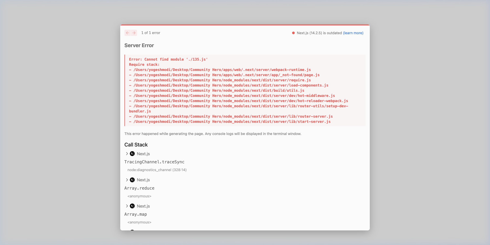
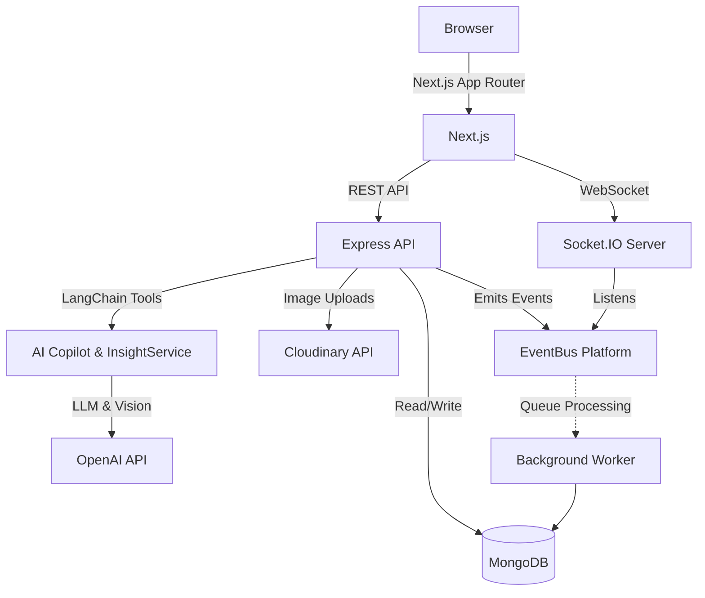

# CommunityOS (v1.0.0 Production Release)

> AI-powered Civic Operating System for modern cities.


CommunityOS is a comprehensive, open-source platform designed to bridge the gap between citizens and their local municipalities. It provides an intuitive reporting interface, real-time telemetry, an event-driven architecture, AI-powered issue classification, proactive civic insights, and powerful geographic visualizations.

## Screenshots

<div align="center">
  
  
</div>
<div align="center">
  
  
</div>

## Features

### 🏛️ Citizen Experience

- **Report Issues:** Submit infrastructure issues, potholes, or safety hazards with photos.
- **Live Feed:** See a real-time stream of all reported issues in the community.
- **Leaderboards:** Gamified civic engagement to encourage active community participation.

### 📊 Municipality Dashboard

- **Mission Control:** High-level telemetry of the city's infrastructure health.
- **Interactive Maps:** WebGL-powered clustered map visualization using Mapbox GL JS.
- **Real-time Notifications:** WebSocket-powered live updates of incoming reports.

### 🤖 AI Intelligence Platform

- **Automated Classification:** Uses OpenAI Vision to automatically categorize reports, assess severity, and detect hazards.
- **Civic Copilot:** A conversational AI assistant equipped with LangChain tools for municipal officials and citizens.
- **Proactive Insights:** Generates weekly summaries, predictive trend analyses, and calculates the City Health Score.

### ⚙️ Engineering & Architecture

- **Event-Driven Core:** Fully decoupled architecture using an EventBus and standardized domain events (`packages/events`).
- **Real-Time Sockets:** Socket.IO orchestrates instant live updates to clients when domain events occur.
- **Turborepo:** High-performance build system for the monorepo architecture.
- **Shared Packages:** Isolated UI components, hooks, validation schemas, and database repositories.
- **Type Safety:** End-to-end TypeScript enforcement.

## Architecture

CommunityOS is built using a modern decoupled architecture.



## Monorepo Structure

```text
.
├── apps/
│   ├── web/        # Next.js 14 Frontend Application
│   ├── api/        # Express.js REST API Backend
│   ├── worker/     # Background job processing (AI categorization)
│   └── admin/      # Internal backoffice tools
├── packages/
│   ├── ui/         # Shared React components (TailwindCSS)
│   ├── database/   # Prisma ORM and DB client
│   ├── validation/ # Shared Zod schemas (API & Frontend)
│   ├── config/     # Environment variable validation
│   └── logger/     # Standardized logging
└── docs/           # Architecture and API documentation
```

## Tech Stack

- **Frontend:** Next.js 14, React, Tailwind CSS, Lucide Icons, Mapbox GL JS
- **Backend:** Node.js, Express, Socket.io
- **Database:** MongoDB, Prisma ORM, Redis (Queues)
- **Tooling:** TypeScript, Turborepo, ESLint, Prettier

## Quick Start

### 1. Clone the repository

```bash
git clone https://github.com/YogeshModi24/CommunityOS.git
cd CommunityOS
```

### 2. Install dependencies

```bash
npm install
```

### 3. Environment Variables

Never expose secrets! Use the provided example files to set up your local environment:

- `apps/api/.env.example` -> `apps/api/.env`
- `apps/web/.env.local.example` -> `apps/web/.env.local`

### 4. Run Locally

```bash
npm run dev
```

This will concurrently start the `web`, `api`, and `worker` applications using Turborepo.

## Documentation

For a deeper dive, read the comprehensive documentation:

- [System Architecture](ARCHITECTURE.md)
- [Future Roadmap](ROADMAP.md)
- [API Reference](docs/api/api-overview.md)
- [Deployment Guide](docs/guides/deployment.md)
- [Contributing](CONTRIBUTING.md)

## Roadmap

- [x] Citizen Reporting App
- [x] Municipality Mission Control
- [x] AI Vision Classification
- [x] Mapbox GL Clustering
- [x] Event-Driven Real-time Platform
- [x] AI Civic Copilot & Insights
- [ ] Mobile Application (React Native)
- [ ] Push Notifications

## License

This project is licensed under the MIT License - see the [LICENSE](LICENSE) file for details.
