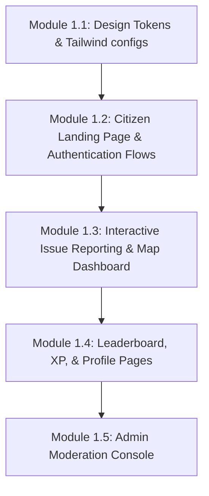

# Sprint 1 Implementation Plan

## Presentation & Experience Layer Roadmap

This implementation plan details the strategy for building the premium presentation layer of **CommunityOS** while maintaining the engineering foundations of Sprint 0.

---

## 1. Module Execution Sequence

To minimize risk and ensure clean integration, development will proceed in the following order:

### 1.1 Module 1.1: Brand System & Tailwind Setup

- **Objective**: Standardize CSS custom properties, responsive styling, colors (sleek dark mode, tailwind colors), typography, and component states.
- **Dependency**: `@community-os/tailwind-config`, `@community-os/ui`.

### 1.2 Module 1.2: Citizen Landing Page & Auth Flow

- **Objective**: Design clean auth forms (login, sign up) utilizing Typescript validated forms.
- **Dependency**: `apps/web`. Uses `LoginUserUseCase` in the api.

### 1.3 Module 1.3: Issue Dashboard & Map View

- **Objective**: Build the core dashboard map component utilizing Mapbox.
- **Dependency**: `apps/web`. Connects to `ReportIssueUseCase` and `NearbyIssuesQueryDTO` services.

### 1.4 Module 1.4: Leaderboard & XP Tracker

- **Objective**: Build citizen statistics graphs, contribution histories, and point trackers.
- **Dependency**: `apps/web`. Binds to `UserService` and `RewardPolicy`.

### 1.5 Module 1.5: Admin Moderation Console

- **Objective**: Implement admin queues to review and resolve issues.
- **Dependency**: `apps/admin`. Connects to `ResolveIssueUseCase` and `ModerationPolicy`.

---

## 2. Key Milestones

1. **Brand Identity Freeze**: Tailwind layout variables and design tokens verified across `web` and `admin` workspaces.
2. **Interactive Map Launch**: Map component displays live nearby pins and supports coordinate click-reporting.
3. **Admin Queue Activation**: Admin portal successfully updates issue statuses, which updates client dashboards via WebSockets.

---

## 3. Risks and Remediation Strategy

| Identified Risk                   | Impact | Remediation Plan                                                                                                           |
| :-------------------------------- | :----- | :------------------------------------------------------------------------------------------------------------------------- |
| **Mapbox Initialization Latency** | High   | Load Mapbox libraries asynchronously; defer loading map coordinates until dashboard panels are focused.                    |
| **WebSocket Connection Blocker**  | Medium | Implement auto-reconnection client libraries and fallback to standard polling if sockets are blocked.                      |
| **Next.js Hydration Mismatches**  | Medium | Use client-only wrappers (`useEffect` or `dynamic` imports) for components that depend on browser APIs (like geolocation). |

---

## 4. Verification Gates & Success Criteria

Every module must pass the following gates:

- **Build Checks**: Zero compilation errors under `npm run typecheck`.
- **Quality Gates**: Zero linter errors under `npm run lint`.
- **UI Testing**: Manual verify that Map coordinates, authentication fields, and button focus states work correctly.
- **Design Review**: Ensure CSS layouts are responsive and visual designs feel premium.
