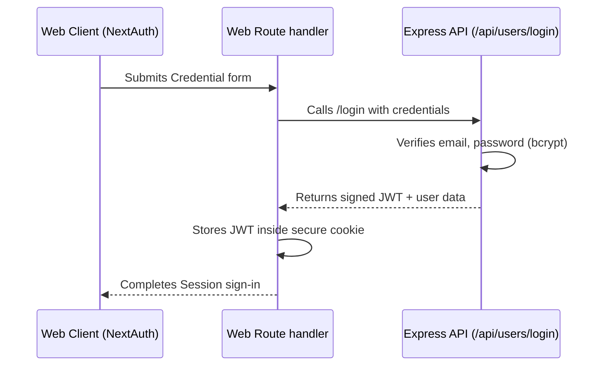

# Current State Report: CommunityHero Architectural Discovery

- **Version**: 1.0.0
- **Owner**: Lead Staff Engineer & CTO
- **Review Date**: June 25, 2026

This document presents a comprehensive architectural discovery and discovery audit of the **CommunityHero** codebase prior to its migration to **CommunityOS** (Sprint 0.1).

---

## 1. Folder Structure (Current State)

The project currently has a basic monorepo structure utilizing npm workspaces and Turborepo (v2.0).

```
.
├── .turbo/                    # Turborepo cache
├── apps/
│   ├── api/                   # Node.js/Express backend
│   │   ├── src/
│   │   │   ├── controllers/   # Controllers: issueController, userController, voteController
│   │   │   ├── jobs/          # BullMQ background tasks: queue, aiWorker
│   │   │   ├── lib/           # DB connectors (Mongoose, Redis, Cloudinary)
│   │   │   ├── middleware/    # Express middlewares (auth, multer upload)
│   │   │   ├── models/        # Mongoose schemas: Issue, User
│   │   │   ├── routes/        # Express routes: issues, users
│   │   │   ├── services/      # Business logic services: aiService, priorityService
│   │   │   ├── index.ts       # Express server entry point
│   │   │   ├── env.ts         # Environment validation
│   │   │   └── seed.ts        # MongoDB seeding script
│   │   ├── package.json
│   │   └── tsconfig.json
│   └── web/                   # Next.js 14 web client
│       ├── app/               # App Router pages and assets
│       ├── components/        # Frontend UI components
│       ├── hooks/             # Custom React hooks (useGeolocation, useSocket)
│       ├── lib/               # Shared logic (api client, auth callbacks, socket.io)
│       ├── types/             # Frontend custom TypeScript types
│       ├── package.json
│       ├── tailwind.config.js
│       └── tsconfig.json
├── node_modules/
├── package-lock.json
├── package.json               # Monorepo workspaces definition
└── turbo.json                 # Turborepo task pipeline
```

---

## 2. Dependency Graph & Packages Analysis

### Root Package (`/package.json`)

- **Package Manager**: npm (v10.0.0 via workspaces definition)
- **Workspaces**: `apps/*`
- **Dependencies**: `turbo` (v2.0.0)

### API Workspace (`apps/api`)

- **Core Runtime**: Node.js (Express v4.18.0)
- **Primary Database ORM**: Mongoose (v8.0.0)
- **Background Workers**: BullMQ (v5.0.0)
- **Caching / Event Store**: ioredis (v5.0.0)
- **AI Processing**: `@langchain/core` (v0.3.0) and `@langchain/openai` (v0.3.0)
- **Authentication Security**: `bcryptjs` (v2.4.3), `jsonwebtoken` (v9.0.0)
- **File Ingestion**: `multer` (v1.4.5-lts.1), `cloudinary` (v2.0.0)
- **Validation**: Zod (v2.22.0)
- **Dev Dependencies**: `typescript`, `ts-node`, `ts-node-dev`, `@types/express`, `@types/jsonwebtoken`, etc.

### Web Workspace (`apps/web`)

- **Framework**: Next.js (v14.2.5), React (v18.3.0), React-DOM (v18.3.0)
- **State Management**: NextAuth (Auth.js v5.0.0-beta.19), standard local useState
- **Styling**: Tailwind CSS (v3.4.0), PostCSS, Autoprefixer, Radix UI primitives (`@radix-ui/react-dialog`, `react-toast`, etc.), `class-variance-authority` (CVA), `tailwind-merge`, `clsx`
- **Map Visualizer**: Leaflet (v1.9.4), mapbox-gl (v3.5.0), react-map-gl (v7.1.0)
- **WebSockets Client**: `socket.io-client` (v4.7.0)
- **HTTP Client**: Axios (v1.7.0)
- **Animations**: Framer Motion (v12.40.0)
- **Icons**: Lucide React (v0.441.0)
- **Utilities**: `date-fns` (v3.6.0)

---

## 3. Communication & Data Flows

### API Endpoints (v1 REST)

- `POST /api/users/login`: Authenticates credentials (returns JWT and user profile).
- `GET /api/users/me`: Gets the logged-in user profile (requires Bearer JWT).
- `GET /api/users/leaderboard`: Gets top-10 active users sorted by points.
- `GET /api/issues/analyze?url=`: Synchronously runs image categorization with OpenAI Vision.
- `GET /api/issues/nearby`: Gets issues within a bounding radius (returns geoJSON Features).
- `GET /api/issues`: Paginated, filtered list of reported issues.
- `POST /api/issues`: Submits a new issue (auth is optional with fallback).
- `GET /api/issues/:id`: Retrieves issue details.
- `PATCH /api/issues/:id/status`: Updates issue status (requires JWT).
- `POST /api/issues/:id/vote`: Increments/decrements voter array (requires JWT).

### Authentication Flow



### Real-Time Sockets.io Pipeline

- **Connection**: Managed by `apps/web/lib/socket.ts` initialized to backend URL.
- **Events**:
  - `issue:new`: Broadcast by `AIWorker` to all clients when background visual analysis finishes.
  - `issue:voted`: Broadcast by `voteController` when a user increments/decrements a vote.

---

## 4. Environment Configuration

### Apps API Environment

- `PORT` (Default: 5001)
- `MONGODB_URI` (Atlas connection string)
- `REDIS_URL` (Upstash connection string)
- `GROQ_API_KEY` (SaaS key / "mock")
- `CLOUDINARY_CLOUD_NAME` / `CLOUDINARY_API_KEY` / `CLOUDINARY_API_SECRET`
- `JWT_SECRET` (For token signing)
- `CLIENT_URL` (Cross-origin configuration: http://localhost:3000)

### Apps Web Environment

- `NEXT_PUBLIC_API_URL` / `NEXT_PUBLIC_SOCKET_URL` (http://localhost:5001)
- `NEXT_PUBLIC_MAPBOX_TOKEN` (For maps integration)
- `NEXT_PUBLIC_CLOUDINARY_CLOUD_NAME` / `NEXT_PUBLIC_CLOUDINARY_UPLOAD_PRESET` (Direct image uploads)
- `NEXTAUTH_SECRET` / `AUTH_SECRET` (Secure cookies)
- `NEXTAUTH_URL` (http://localhost:3000)
- `AUTH_TRUST_HOST` (true)

---

## 5. Technical Debt & Design Flaws

1. **Tight Coupling to MongoDB**: All logic is tied to Mongoose schemas. Database transactions, indexing (e.g. `2dsphere`), and object ID operations are hardcoded in controllers.
2. **Scattered Configurations**: TSConfig and ESLint settings are duplicated between the Express backend and the Next.js frontend, preventing centralized formatting standards.
3. **No Database Abstraction**: Controllers (`issueController.ts`, `voteController.ts`) call Mongoose queries directly. There is no repository layer, making unit testing database logic impossible.
4. **Mock Execution Paths**: Mock configurations (e.g., `useMock` in `queue.ts` and `aiService.ts`) are hardcoded in checks like `!REDIS_URL || REDIS_URL === 'mock'`.
5. **No Domain Layer**: Business logic—like priority score calculations—lives in the controller layer or basic helper functions rather than an isolated domain layer.
6. **No Centralized Logging**: Backend code utilizes unstructured `console.error` and `console.log` messages, complicating logging integration for production.
7. **NextAuth Client Interceptor**: Axios interceptor uses client-side `getSession()` asynchronously, causing high CPU/session checks on every request.

---

## 6. SWOT Analysis (Current Infrastructure)

### Strengths

- **Functional AI Fallbacks**: Fallbacks allow testing without live OpenAI and Redis configurations.
- **State Boundaries**: The web application successfully isolates pages into dashboard modules.

### Weaknesses

- **Monolithic API Engine**: The Express backend acts as database client, WebSocket broadcaster, router, and job queue executor simultaneously.
- **No Shared Packages**: No shared types or utilities, leading to duplicated configurations across workspaces.
- **No Error Handling Standards**: Endpoints wrap logic in raw `try/catch` and return arbitrary `500` messages.
- **Hardcoded Styling Rules**: Tailwind color names and configurations are not shared, resulting in inconsistent styles.
